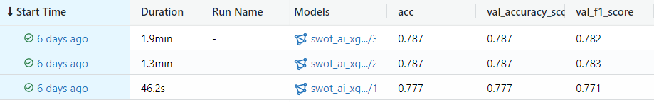
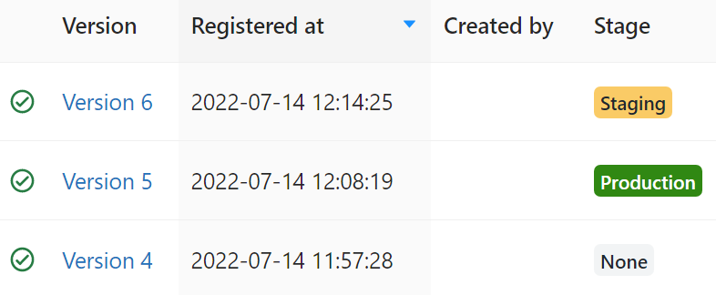
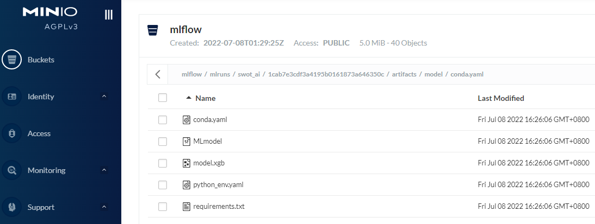

# MLOps  

使用了一個NLP，文本分類專案為例，建構基礎的MLOps管理流程。
達成以下效果：

* 🎁即時監控AI產品的線上商業價值 (Continuous monitoring)
* 🎁即時監控AI模型品質，可依照需求，線上或線下重新訓練模型。(Continuous training)
* 🎁即時監控模型輸入資料品質，即時監控模型預測品質。(Feature drift, Label drift)
* 🎁模型生命週期管理：AI實驗過程自動記錄參數與指標，管理模型性能指標。(AI model life cycle management)
* 🎁訓練資料版本管理，Pipeline 版本管理，模型版本管理。(Versioning)
* 🎁標註資料推薦，將Feature drift，的資料，以及預測不確定的資料，推薦給管理者優先標註。 (Data labelling recommendations)

---

### 安裝 MLOps 基礎服務:

MLOps 基礎服務 (MLflow + MySQL + MinIO + Prometheus + Grafana) :
整體系統架構如下：

<kbd></kbd>

#### 安裝步驟 
	docker-compose up

#### 驗證各種服務正常運作

* MLflow: your_ip:5001
* MySQL:  your_ip:3307
* MinIO:  your_ip:9000
* Prometheus: your_ip:9090
* Grafana: your_ip:3000

docker-compose 的設定文件在 .env，可以改各系統的預設帳號/密碼/Port等設定。

---

### 安裝 AI Service (Optional, 可自行替換其他的AI服務):
##### Run on docker container:

	docker build -t swot_ai:v1 -f "./mlops_docker/dockerfiles/ai_app_service/Dockerfile" .
	docker run --name swot_ai_service -p 5000:5000　swot_ai:v1

##### Run on physical machine :

	pip install requirements.txt
	cd web
	python app.py
	
第一次啟動服務，會自動下載語言模型： hfl/chinese-roberta-wwm-ext，需等待下載完成才可使用服務。
瀏覽器開啟： your_ip:5000

### 系統畫面展示:

#### AI服務： 
 <kbd></kbd>
 
 
#### AI模型，線上監控畫面(Grafana)： 
預設存取位置: your_ip:3000
預設帳號密碼: admin/admin

<kbd></kbd>
 
<kbd></kbd>

監控儀表板預設位置 your_ip:3000 
Grafana 儀表板設定 template 可參考 config/grafana/ai_service_default_dashboard.json

---

#### AI模型，生命週期管理：
模型訓練實驗，自動記錄參數，指標，自動產生模型版本控制　(MLflow) 
模型訓練程式碼：
* train/feature_train_xgb_flow.py

執行程式碼後，在MLflow中，儲存模型紀錄，與模型版本：

<kbd></kbd>

執行程式碼後，在MLflow中，註冊模型與版本號：

<kbd></kbd>

---

#### AI模型，儲存管理：　(MinIO)
不同版本的模型，可設定儲存在　Amazon S3 或是　MinIO:

 <kbd></kbd>

---

### MLOps 活動介紹

 <kbd></kbd>

* 水平整合：商業價值統計，AI使用量，線上資料品質，線上預測品質，模型品質紀錄，模型開發環境紀錄，模型實驗參數紀錄，ML Pipeline程式碼紀錄。
* 垂直整合：AI服務監控，AI模型品質監控，容器環境監控，網路可用性監控，硬體計算資源監控

---

#### 常見問題

###### 使用　MySQL　做為　MLFlow 的　tracking storage
須注意　experiment name 預設不可直接使用中文。

(pymysql.err.OperationalError) (1267, "Illegal mix of collations (latin1_swedish_ci,IMPLICIT) and (utf8mb4_general_ci,COERCIBLE) 
修改方式：

	SET collation_connection = 'utf8_general_ci';

###### MLflow 預設使用了　matplotlib 繪製實驗結果　
須注意　MLflow 的實驗跑在其他thread 會導致matplotlib產生錯誤
RuntimeError: main thread is not in main loop

修改方式：(修改 matplotlib backend)

https://stackoverflow.com/questions/49921721/runtimeerror-main-thread-is-not-in-main-loop-with-matplotlib-and-flask

	import matplotlib
	matplotlib.use("svg")
	import matplotlib.pyplot as plt

