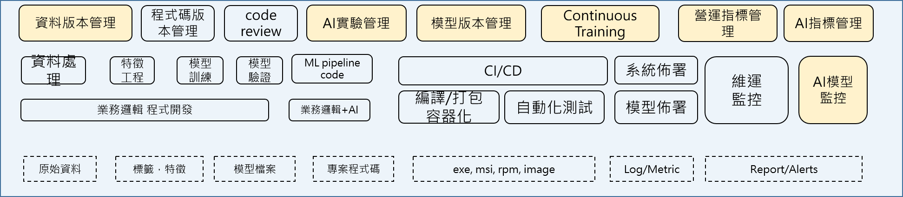
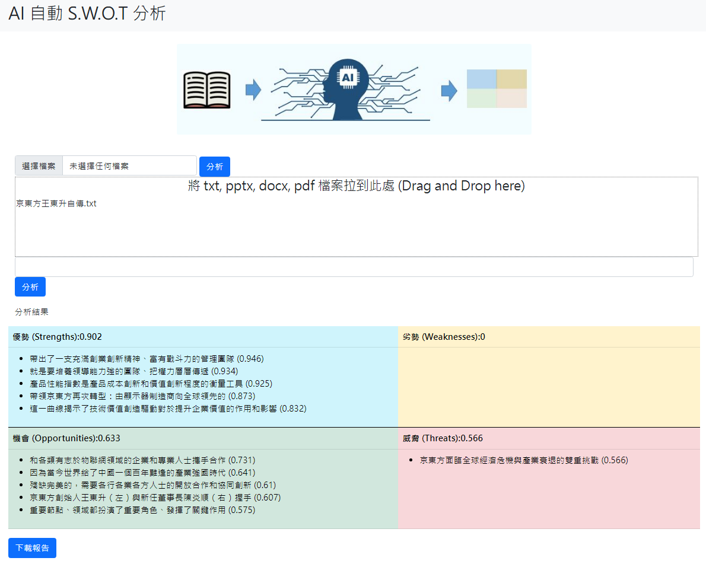
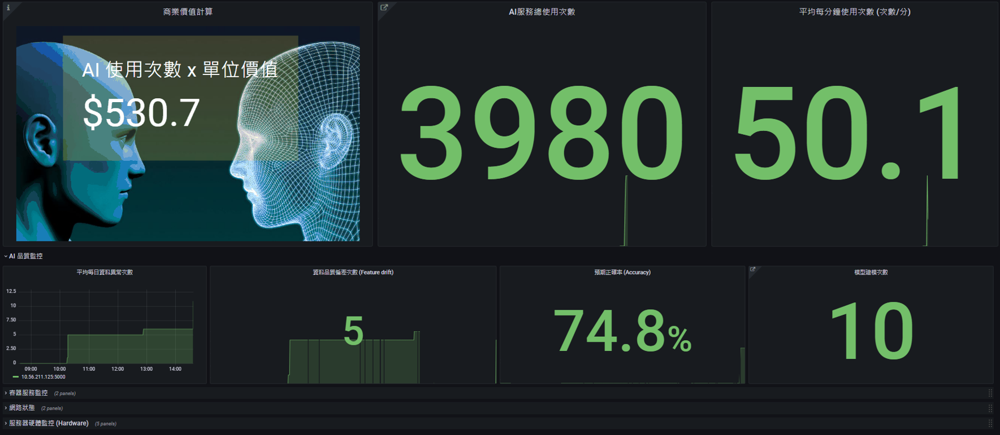
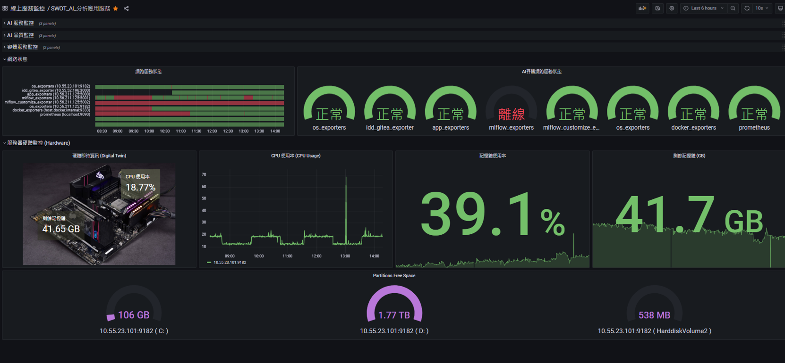

# MLOps  
* 保障與監控AI產品的商業價值
* 使AI產品開發成本降低，工作效率提升。
* 線上服務可管理監控，模型品質不佳可監控，可重新訓練。

* MLOps 活動
* 

### 系統架構
* 

* 水平整合：商業價值統計，AI使用量，線上資料品質，線上預測品質，模型品質紀錄，模型開發環境紀錄，模型實驗參數紀錄，ML Pipeline程式碼紀錄。
* 垂直整合：AI服務監控，AI模型品質監控，容器環境監控，網路可用性監控，硬體計算資源監控
---
### 實際範例

### AI 自動產生 S.W.O.T 分析報告
* 輸入：任意文件 --> 輸出：S.W.O.T 分析
* 

* 模型服務後台監控畫面
* 
* 

---
#如何安裝整套系統

1.準備硬體環境
	
	硬體需求：Ram:8GB, Disk space：4GB 

2.安裝 Python package
	
	下載程式碼
	git clone (path to repository...)
	cd strategy_ai
	
	安裝套件:
	pip install -r requirements_cpu.txt
	
	若有CUDA GPU 環境，建議使用GPU版本:
	pip install -r requirements_gpu.txt

3.安裝 Docker

	# 讓 bash 可以正常讀取 UTF-8:
	export LC_ALL=C.UTF-8
	export LANG=C.UTF-8
	# 讓 python 可正常讀取到所有module
	export PYTHONPATH=PYTHONPATH:(...Your install path tO...)/strategy_ai
	
4.使用 docker-compose 安裝 MLOps Containers
	

# 如何使用

### 分析大量文件: 
	步驟1: 將分析資料，放在data目錄下
	步驟2: 修改 src/file_analysis.py, 其中 file_list 設定成需要分析的檔名
	步驟3: python file_analysis.py
	步驟4: 分析結果將儲存於 output/ 目錄下

### 啟動Web展示畫面：

	cd web 
	python app.py

### 使用常見問題：
	* 系統啟動慢。：原因：第一次執行時，系統會上網下載模型。
	* 網頁顯示不正常：前端使用 VUE 的 CDN，需存取外部網路。
	* 網頁顯示卡住：前端尚未做過渡頁面。分析100個句子需要等待7秒。

# 原始碼說明
## 程式碼結構說明

* config 存放各種系統設定 
* data 存放需要分析的資料
* output 存放分析結果
* pic 存放圖片 
* src 存放程式主要流程 
* utils 存放各種工具。 

# 系統運行參數說明

## 系統參數設定檔案
	
	config/label - 用來設定 標籤，對應的顯示名稱
	config/sys - 設定系統預設的 標籤分類樣本
	config/usr - 用戶自定義的 標籤分類樣本
	
### AI 編碼器設定
	
	編碼器(Encoder)，有N兩種選擇：
	建議使用的模型："hfl/chinese-roberta-wwm-ext"
	

---
### 開發 Roadmap
* 簡化流程

	